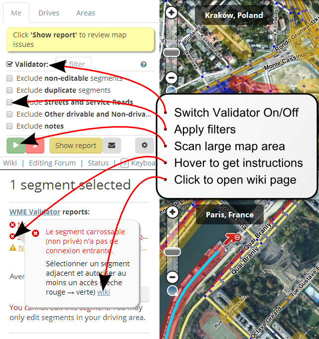

About WME Validator
===================

Chrome Web Extension for [Waze Map Editor](https://waze.com) to validate map vector data and locations, scan big map areas for issues, generate detailed report with references and solutions.

* Supports 150+ validation rules for vector data, attributes, and locations (places)
* The rules are adapted to 26+ countries by local communities
* UI has been translated to 10+ languages by community

WME Validator uses Open Source GPLv3 license, i.e. you may copy,
distribute and modify the software as long as you track changes/dates
in source files. Any modifications to or software including
(via compiler) GPL-licensed code must also be made available under
the GPL along with build & install instructions.

Please check the doc directory for more information.

For questions please use official forum: \
https://www.waze.com/forum/viewtopic.php?f=819&t=76488

Report bugs on GitHub Issues Tracker: \
https://github.com/WMEValidator/validator/issues

QUICK START
-----------

Install Closure Compiler
------------------------

WME Validator uses Google Closure Compiler: \
https://developers.google.com/closure/compiler/

To install the compiler on Linux Ubuntu:

    sudo apt install closure-compiler

To install Closure Compiler on macOS:

    brew install closure-compiler

Check if Closure Compiler is correctly installed:

    $ closure-compiler --version
    Closure Compiler (http://github.com/google/closure-compiler)
    Version: v20180805
    Built on: 2018-08-09 20:09

Get WME Validator source files
------------------------------

WME Validator uses `git` as a version control system and hosted on GitHub: \
https://github.com/WMEValidator/

To get the sources with all the sub-modules run:

    git clone --recurse-submodules git@github.com:WMEValidator/validator

Build WME Validator
-------------------

At the moment WME Validator uses few custom build scripts:

- `release.sh` -- to produce a normal release file in `build/WME_Validator.user.js`
- `debug.sh` -- to produce a debug version (`DEBUG` is defined, simple
   optimizations) in `build/WME_Validator.debug.js`
- `gf.sh` -- to produce formatted release file for GreasyFork in  `build/WME_Validator.gf.js`

Example build run:

    $ cd validator
    $ ./10.release.sh
    ===> Building build/WME_Validator.user.js
    Localizations: EN US UK SK SG RU PL NZ NL MY MX LU IT IL IE FR ES DE CZ CL CH BN BG BE AU AT AR
    ===> Done.
